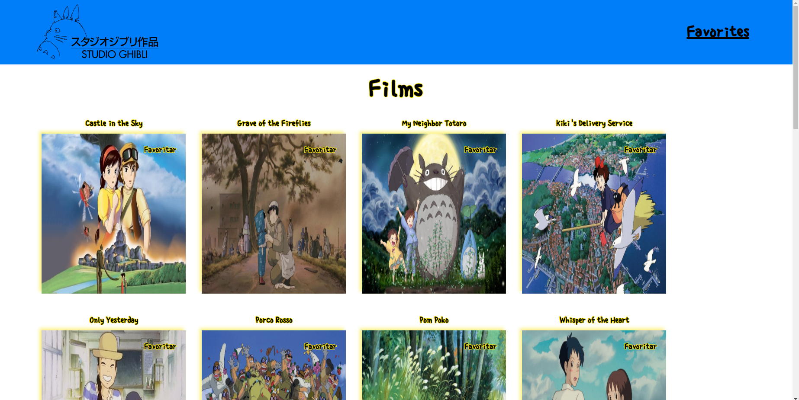

# My Project

# Contexto
Site criado com React para aprimorar o conhecimento sobre o uso do Context, o site mostra uma lista de filmes do Studio Ghibli onde o usuário pode favoritar e desfavoritar seus filmes preferidos.

## Técnologias usadas

Front-end:
> Desenvolvido usando: React, Context, CSS, HTML, ES

## Acessar o site


> [Ghibli](https://davialpiano.github.io/Films_Ghibli/)


## Instalando Dependências
 
```bash
npm install
``` 
## Executando aplicação

* Para rodar o front-end:

  ```
    npm start
  ```

## Executando Testes

* Para rodar todos os testes:

  ```
    npm test
  ```


